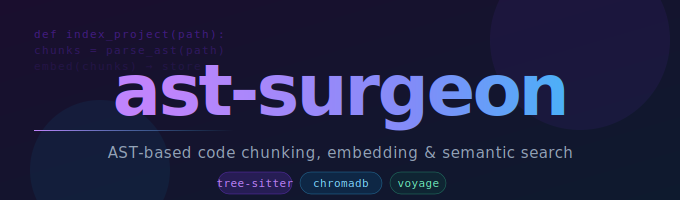
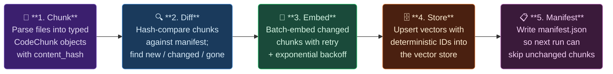

<div align="center">



<p>
  <a href="https://pypi.org/project/ast-surgeon"></a>
  <a href="https://pypi.org/project/ast-surgeon"></a>
  
  
  
</p>

<p>
  <a href="#-installation">Installation</a> ·
  <a href="#-quick-start">Quick Start</a> ·
  <a href="#%EF%B8%8F-cli">CLI</a> ·
  <a href="#-embedding-providers">Providers</a> ·
  <a href="#%EF%B8%8F-how-indexing-works">How it works</a>
</p>

</div>

---

**ast-surgeon** parses your code with [tree-sitter](https://tree-sitter.github.io/tree-sitter/) to split it into meaningful chunks - functions, classes, methods, docstrings, prose - embeds those chunks with the provider of your choice, and stores them in a vector database for fast semantic search. A built-in file watcher keeps the index in sync as you edit.

---

## ✨ Features

| | |
|---|---|
| 🌳 **AST-aware chunking** | Python, JS, JSX, TS, TSX - functions, classes, decorators, docstrings, call graphs. Plus a prose chunker for Markdown / RST. |
| 🔌 **Pluggable embeddings** | Voyage AI, OpenAI, Cohere, Gemini, Mistral, or a fully offline `sentence-transformers` model. |
| 🗄️ **Pluggable vector stores** | ChromaDB (local, zero-config), Qdrant, or Pinecone - swap with a single argument. |
| ⚡ **Incremental indexing** | Only re-embeds changed chunks, tracked via a content-hash manifest. Re-indexing unchanged code is a true no-op. |
| 👁️ **Live sync** | `watchdog`-based file watcher debounces saves and re-indexes in place - sub-second updates. |
| 🖥️ **CLI included** | `index`, `search`, `watch` - everything you need from the terminal. |

---

## 📦 Installation

```bash
pip install ast-surgeon
```

By default, only the lightweight core is installed. Add extras for the backends you want:

```bash
pip install "ast-surgeon[chroma]"        # local vector store (recommended to start)
pip install "ast-surgeon[qdrant]"        # Qdrant vector store
pip install "ast-surgeon[pinecone]"      # Pinecone vector store
pip install "ast-surgeon[local-embed]"   # offline embeddings via sentence-transformers
pip install "ast-surgeon[all]"           # everything
```

---

## 🚀 Quick Start

### Library

```python
from ast_surgeon import Indexer

# Chroma (local, on-disk) + auto-detected embedding provider
# (first provider found via VOYAGE_API_KEY / OPENAI_API_KEY / ... / local)
indexer = Indexer.create("/path/to/project")

result = indexer.index_project()
print(result)  # IndexResult(files=42, changed=42, +138/-0 chunks, ...)

hits = indexer.search("how does authentication work?", top_k=5)
for hit in hits:
    print(f"{hit.score:.3f}  {hit.chunk.qualified_name()}")
    print(hit.chunk.content[:200])
```

### Choosing a provider and store explicitly

```python
from ast_surgeon import Indexer

indexer = Indexer.create(
    "/path/to/project",
    store_type="qdrant",                  # "chroma" | "qdrant" | "pinecone"
    store_kwargs={"url": "https://xyz.qdrant.io", "api_key": "..."},
    embedding_provider="cohere",          # "voyage" | "openai" | "cohere" | "gemini" | "mistral" | "local"
)
indexer.index_project()
```

### Live-updating index

```python
from ast_surgeon import Indexer, FileWatcher

indexer = Indexer.create("/path/to/project")
indexer.index_project()

with FileWatcher(indexer, "/path/to/project") as watcher:
    # index stays in sync with on-disk changes while this block runs
    ...
```

### Chunking only (no embeddings or vector store)

```python
from ast_surgeon import chunk_file

source = open("auth.py").read()
for chunk in chunk_file("auth.py", source):
    print(chunk.chunk_type, chunk.qualified_name(), chunk.start_line, chunk.end_line)
```

---

## 🖥️ CLI

```bash
# Index the current directory (uses Chroma + auto-detected embeddings)
ast-surgeon index .

# Search a previously-indexed project
ast-surgeon search "how does login work" .

# Index, then keep watching for changes
ast-surgeon watch .

# List available embedding providers and vector stores
ast-surgeon providers
```

**Common options** for `index` / `search` / `watch`:

| Flag | Values | Description |
|------|--------|-------------|
| `--store` | `chroma`, `qdrant`, `pinecone` | Vector store backend (default: `chroma`) |
| `--embedding-provider` | `voyage`, `openai`, `cohere`, `gemini`, `mistral`, `local` | Embedding provider (default: auto-detect) |

`search` also supports `--top-k`, `--language`, and `--file` filters.

---

## 🧠 Embedding Providers

| Provider | Env var | Dimensions | Notes |
|----------|---------|:----------:|-------|
| `voyage` | `VOYAGE_API_KEY` | 1536 | Best code retrieval |
| `openai` | `OPENAI_API_KEY` | 1536 | General-purpose, popular |
| `cohere` | `COHERE_API_KEY` | 1024 | Great recall |
| `gemini` | `GEMINI_API_KEY` | 768 | Free tier available |
| `mistral` | `MISTRAL_API_KEY` | 1024 | Fast and cheap |
| `local` | - | varies | Offline, requires `[local-embed]` |

**Provider resolution order:** explicit `name` arg → `AST_SURGEON_EMBEDDING_PROVIDER` env var → first provider with an API key set → `local` as final offline fallback.

---

## ⚙️ How Indexing Works



1. **Chunking** - each file is parsed into `CodeChunk` objects (functions, classes, methods, docstrings, prose blocks), each with a `content_hash`.
2. **Diffing** - new/changed chunks are collected for embedding; unchanged chunks are left untouched; disappeared chunks are deleted from the store.
3. **Embedding** - changed chunks are embedded in batches with retry + exponential backoff. Failed chunks are recorded and retried on the next run rather than silently dropped.
4. **Storage** - vectors and metadata are upserted using a deterministic ID derived from `(file_path, name, content_hash)`, so re-indexing unchanged code is a true no-op.
5. **Manifest** - `.ast-surgeon/manifest.json` in the project root tracks what's indexed, enabling fast incremental re-indexing and sub-second watcher updates.

### ⚠️ Known Limitation

The manifest and the vector store are tracked independently. If you point an existing project at a **new or different** vector store, `index_project()` will see chunks as "unchanged" (per the manifest) and skip re-embedding them - leaving the new store incomplete.

> **When switching vector stores, delete `.ast-surgeon/` first to force a full re-index.**

---

## 🛠️ Development

```bash
git clone https://github.com/Darsh-Nandu/ast-surgeon.git
cd ast-surgeon
pip install -e ".[dev,all]"
pytest
```

---

## 📄 License

See the repository for license information.